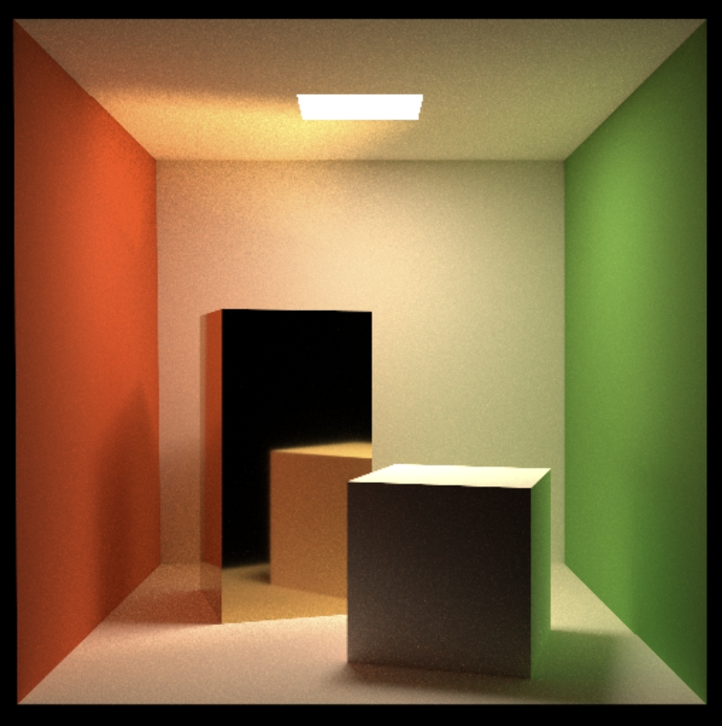
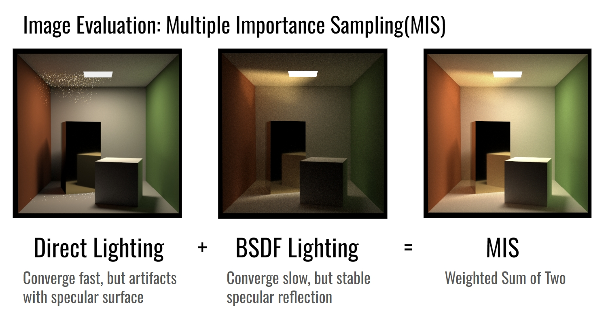

# CUDA Path Tracer

<p align="center">
  
</p>
<p align="center">Cornell Box, 1k*1k resolution, SPP 4096, Max Depth 20</p><br>

## Environment

- cuda/11.7.0-7sdye3
- Nvidia V100 GPU

## Getting Started

### Linux or Mac

```bash
./scripts/setup.sh

./scripts/run.sh cpu_path_tracer/gpu_path_tracer 
# or
./scripts/run.sh cpu_path_tracer/gpu_path_tracer  <SPP>
# or
./scripts/run.sh cpu_path_tracer/gpu_path_tracer  <SPP> <MaxDepth>
# or
./scripts/run.sh cpu_path_tracer/gpu_path_tracer  <SPP> <MaxDepth> <Threads>
```

### Windows

```bash
./scripts/setup.bat

./scripts/run.bat cpu_path_tracer/gpu_path_tracer  
# or
./scripts/run.bat cpu_path_tracer/gpu_path_tracer  <SPP>
# or
./scripts/run.bat cpu_path_tracer/gpu_path_tracer  <SPP> <MaxDepth>
# or
./scripts/run.bat cpu_path_tracer/gpu_path_tracer  <SPP> <MaxDepth> <Threads>
```

Now, view the output image in the `out` directory at root.

## Features

- BVH Acceleration Structure
- Monte Carlo Integration
- Direct Lighting with Multiple Importance Sampling
- Physically-Based Materials
  - Lambertian: a classic diffuse material used to represent rough surfaces
  - Dielectric: a transparent material having both reflection and refraction. Used to simulate glass, water, air or any "clear and specular" media
  - Metallic workflow: a popular material model used in the industry. It has two parameters, Metallic and Roughness. By changing the value of two parameters, we can simulate a variety of materials such as plastic, glossy metal and mirror. It's very expressive and artist friendly, and easy to combine with textures to create realistic rendering. The model implemented by the renderer is a mixture of Lambertian diffuse and Trowbridge-Reitz (GGX; GTR2) microfacet specular
- OpenMP Parallelism for CPU Path Tracer
- Russian Roulette for Path Termination for CPU Path Tracer
- Faster Tree Traversal on GPU: Multiple-Threaded BVH

### Multiple Importance Sampling

<p align="center">
  
</p>
<p align="center">MIS</p><br>

## Roadmap

- [x] CPU Path Tracer
- [x] Anti-Aliasing by Jittered Sampling
- [x] Construct GPU-friendly BVH
- [ ] Self-defined material description file

### GPU Parallelism

- Naive GPU Path Tracer
  - [x] Thread-per-pixel parallelism (# of threads = # of pixels)
- GPU Path Tracer
  - [x] Thread-per-path parallelism (# of threads = # of paths = # of pixels * SPP)
- Work-Efficient GPU Path Tracer
  - [x] Thread-per-ray parallelism (fixed # of threads)

### Rendering

- [x] Naive Diffuse Surfaces
- [x] Lambert Material
- [x] Metal Material
- [ ] Dielectric Material

### Acceleration Structures

- [x] Naive BVH
- [ ] SAH BVH

## Future Work

- [ ] Building BVH on GPU (LBVH <https://developer.nvidia.com/blog/thinking-parallel-part-iii-tree-construction-gpu/>)

## Contributors

- [Molin Deng](https://molin7.vercel.app/)
- [Kevin Sadi](https://www.kevinsadi.com/)
- [Candong Lin]()
